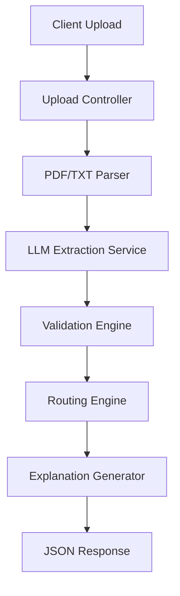

# 🚀 Autonomous Insurance Claims Processing Agent

An AI-powered backend service that automates FNOL (First Notice of Loss) insurance claim processing through intelligent document parsing, structured data extraction, validation, and rule-based routing.

## ✨ Features

- **📄 Document Processing**: Supports PDF and TXT file uploads
- **🤖 AI Extraction**: Uses OpenAI GPT-4 for intelligent data extraction
- **✅ Validation Engine**: Detects missing mandatory fields and validates data quality  
- **🔀 Smart Routing**: Priority-based routing with 5 workflow categories
- **📝 Explainable AI**: Generates human-readable routing justifications
- **🔒 Secure**: Input validation, file type checking, size limits
- **🐳 Docker Ready**: Fully containerized for easy deployment
- **🧪 Tested**: Comprehensive test coverage with Jest

## 🏗️ Architecture



## 🎯 Routing Logic

Claims are routed based on priority (highest to lowest):

| Priority | Route | Trigger Condition |
|----------|-------|-------------------|
| 1 | **Investigation** | Fraud indicators detected in description |
| 2 | **Manual Review** | Missing mandatory fields |
| 3 | **Specialist Queue** | Injury/medical claim type |
| 4 | **Fast Track** | Estimated damage < $25,000 |
| 5 | **Standard Processing** | Default for all other claims |

## 🛠️ Technology Stack

- **Backend**: Node.js, Express.js, TypeScript
- **AI/LLM**: OpenAI GPT-4
- **Validation**: Zod
- **File Processing**: pdf-parse, Multer
- **Testing**: Jest
- **Deployment**: Docker, Docker Compose

## 📋 Prerequisites

- Node.js 20+ or Docker
- OpenAI API key

## ⚡ Quick Start

### Local Development

1. **Clone the repository**
   ```bash
   git clone https://github.com/Manish881-hub/Autonomous-Insurance-Claims-Processing-Agent.git
   cd Autonomous-Insurance-Claims-Processing-Agent
   ```

2. **Install dependencies**
   ```bash
   npm install
   ```

3. **Configure environment**
   ```bash
   cp .env.example .env
   ```
   Then edit `.env` and add your OpenAI API key:
   ```
   OPENAI_API_KEY=your_actual_api_key_here
   ```

4. **Start development server**
   ```bash
   npm run dev
   ```

The API will be available at `http://localhost:3000`

### Docker Deployment

1. **Set environment variable**
   ```bash
   # Windows PowerShell
   $env:OPENAI_API_KEY="your_actual_api_key_here"
   
   # Linux/Mac
   export OPENAI_API_KEY=your_actual_api_key_here
   ```

2. **Run with Docker Compose**
   ```bash
   docker-compose up --build
   ```

## 📡 API Endpoints

### Health Check
```http
GET /health
```

**Response:**
```json
{
  "status": "healthy",
  "environment": "development",
  "timestamp": "2024-02-20T10:30:00.000Z"
}
```

### Process Claim Document
```http
POST /api/claims/process
Content-Type: multipart/form-data

document: <PDF or TXT file>
```

**Example using curl:**
```bash
curl -X POST http://localhost:3000/api/claims/process \
  -F "document=@test-data/sample-fnol-complete.txt"
```

**Example using PowerShell:**
```powershell
$form = @{
    document = Get-Item -Path "test-data\sample-fnol-complete.txt"
}
Invoke-RestMethod -Uri "http://localhost:3000/api/claims/process" -Method Post -Form $form
```

**Response:**
```json
{
  "extractedFields": {
    "policyInformation": {
      "policyNumber": "POL-2024-987654",
      "policyholderName": "Sarah Mitchell",
      "effectiveDates": {
        "startDate": "2024-01-01",
        "endDate": "2025-01-01"
      }
    },
    "incidentInformation": {
      "incidentDate": "2024-02-15",
      "incidentTime": "14:30",
      "incidentLocation": "1234 Main Street, Springfield, IL 62701",
      "incidentDescription": "While driving southbound..."
    },
    "involvedParties": { ... },
    "assetDetails": {
      "assetType": "Vehicle",
      "assetId": "VIN-1HGBH41JXMN109186",
      "estimatedDamage": 3200
    },
    "mandatoryFields": {
      "claimType": "Auto Property Damage",
      "attachments": ["Photos of damage", "Police report #IL-2024-00123"],
      "initialEstimate": 3200
    }
  },
  "missingFields": [],
  "recommendedRoute": "Fast Track",
  "reasoning": "This claim has been routed to **Fast Track** based on the following analysis:\n\n**Decision Factors:**\n1. Estimated damage ($3,200) is below fast track threshold ($25,000)...",
  "triggeredRules": [
    "Estimated damage ($3,200) is below fast track threshold ($25,000)"
  ]
}
```

## 🧪 Testing

### Run all tests
```bash
npm test
```

### Run with coverage
```bash
npm run test:coverage
```

### Test with sample documents
The `test-data/` directory contains 5 sample FNOL documents for testing each routing scenario:

- `sample-fnol-complete.txt` → Standard Processing
- `sample-fnol-missing-fields.txt` → Manual Review
- `sample-fnol-injury.txt` → Specialist Queue
- `sample-fnol-fraud.txt` → Investigation
- `sample-fnol-fast-track.txt` → Fast Track

## 📊 Data Extraction Schema

The system extracts the following structured data:

- **Policy Information**: Policy number, policyholder name, effective dates
- **Incident Information**: Date, time, location, description
- **Involved Parties**: Claimant details, third parties, contact information
- **Asset Details**: Asset type, ID, estimated damage
- **Mandatory Fields**: Claim type, attachments, initial estimate

## 🔧 Configuration

Key environment variables (see `.env.example`):

| Variable | Description | Default |
|----------|-------------|---------|
| `PORT` | Server port | 3000 |
| `OPENAI_API_KEY` | OpenAI API key | *Required* |
| `MAX_FILE_SIZE_MB` | Max upload size | 10 |
| `LLM_MODEL` | OpenAI model | gpt-4 |
| `LLM_TEMPERATURE` | Temperature (0-2) | 0 |
| `LLM_MAX_RETRIES` | Retry attempts | 3 |

##  📁 Project Structure

```
src/
├── config/          # Environment and constants
├── controllers/     # Request handlers
├── middleware/      # Upload, error handling
├── routes/          # API route definitions
├── schemas/         # Zod validation schemas
├── services/        # Business logic
│   ├── parser.service.ts       # PDF/TXT parsing
│   ├── extraction.service.ts   # LLM extraction
│   ├── validation.service.ts   # Data validation
│   ├── routing.service.ts      # Routing engine
│   └── explanation.service.ts  # Reasoning generator
├── utils/           # Helper functions
├── app.ts           # Express app setup
└── server.ts        # Server entry point
```

## 🚦 Performance Requirements

- **Maximum file size**: 10MB
- **Response time target**: < 10 seconds
- **Supported formats**: PDF, TXT

## 🔒 Security Features

- MIME type validation
- File size limits
- Automatic file cleanup
- Input sanitization
- Non-root Docker user

## 🐛 Error Handling

The API returns structured error responses:

```json
{
  "error": "Validation Error",
  "message": "Missing required field: policyNumber",
  "timestamp": "2024-02-20T10:30:00.000Z"
}
```

Common error codes:
- `400` - Bad request (invalid file, validation errors)
- `500` - Server error (LLM extraction failed, parsing error)

## 🤝 Contributing

1. Fork the repository
2. Create a feature branch (`git checkout -b feature/amazing-feature`)
3. Commit your changes (`git commit -m 'Add amazing feature'`)
4. Push to the branch (`git push origin feature/amazing-feature`)
5. Open a Pull Request

## 📄 License

MIT License - see LICENSE file for details

## 👨‍💻 Author

Developed as part of the Autonomous Insurance Claims Processing System

## 🙏 Acknowledgments

- OpenAI for GPT-4 API
- pdf-parse library maintainers
- Express.js and TypeScript communities
